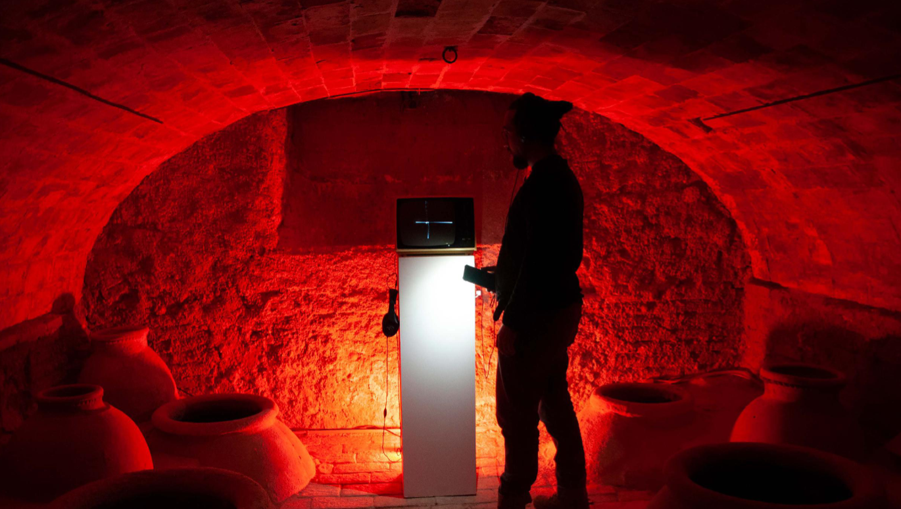

# investigaciones individuales

Nicolás Elías Valdés Greve / [nicolasvaldesgreve](<https://github.com/nicolasvaldesgreve/dis9079-2026-1/tree/main/29-nicolasvaldesgreve>)

## Sonitus Lucis - Arturo Yelo

> Ninguna de las imagenes presentadas en esta investigación me pertenecen, todas fueron rescatadas de la página del Museo Cristobal Gabarron en donde se muestra toda la documentación de la exposición de la obra.

Arturo Yelo es un artista sonoro nacido en el año 1989 en Abarán ubicado en la Región de Murcia, España. Estudió en el Conservatorio Profesional de Murcia y desarrolló su carrera como saxofonista durante 8 años en la Agrupación Musical de Abarán y otros grupos musicales de rock en donde Mez-K es la que tuvo más éxito, en donde participó durante el Viña Rock 2017.

En el año 2024 Arturo inicia su carrera como artista sonoro con la instalación "1984" la cual se ubicó en Cárcel Vieja de Murcia, pero no trabajó solo en este proyecto, sino que fue ideado por el y desarrollado en colaboración con Juan Jesús Yelo, el cual es el actual secretario de la Asociación Murciana de Arte Sonoro y Música Experimental "Intonarumori" mientras que a la vez imparte talleres para la construcción de micrófonos de contacto y sintetizadores foto sensibles.

Arturo mencionó que la manera en la que nació Sonitus Lucis fue mediante una mezcla de emoción y una idea, lo cual da fruto a una inquietud propia lo cual lo lleva a tener la necesidad de expresarlo, pero se pueden preguntar: ¿por qué mediante un sintetizador? pues durante una entrevista Arturo nos cuenta que lo que lo introdujo al área en el que está trabajando actualmente fue su interés por los sintetizadores de los años 80' de Vangelis (1943 - 2022), lo cual lo llevó a investigar sobre sintetizadores en donde se dio cuenta de que todos son capaces de poder crear su propio sintetizador, razón por la cual se dedicó a eso para poder comunicar sus inquietudes mediante sus creaciones.

### Fuentes Artista

+ <https://museo.gabarron.org/Exposiciones/Sonitus-lucis-Arturo-Yelo>
+ <https://es.linkedin.com/in/arturo-yelo-4992b917b>
+ <https://abarandiaadia.com/art/13150/la-luz-se-convierte-en-sonido-en-la-nueva-instalacion-del-abaranero-arturo-yelo>
+ <https://in-sonora.org/ficha-artista/juan-jesus-yelo/>
+ <https://www.youtube.com/watch?v=anugJX3VaFA>

---

## Sensor

## Actuador

## Bibliografía
